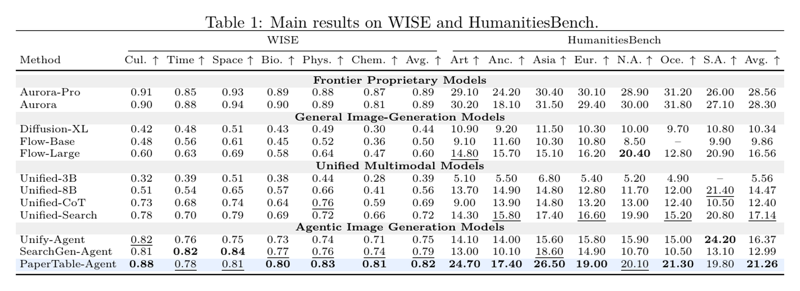
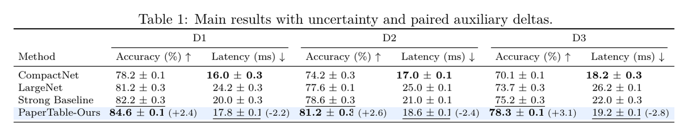
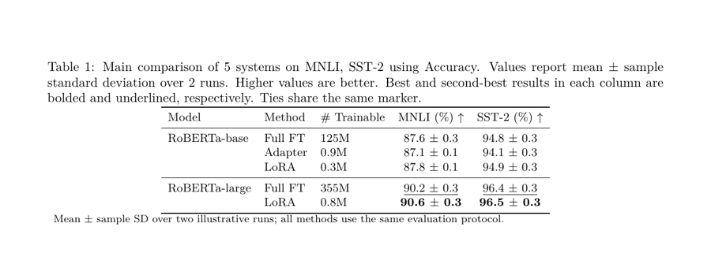
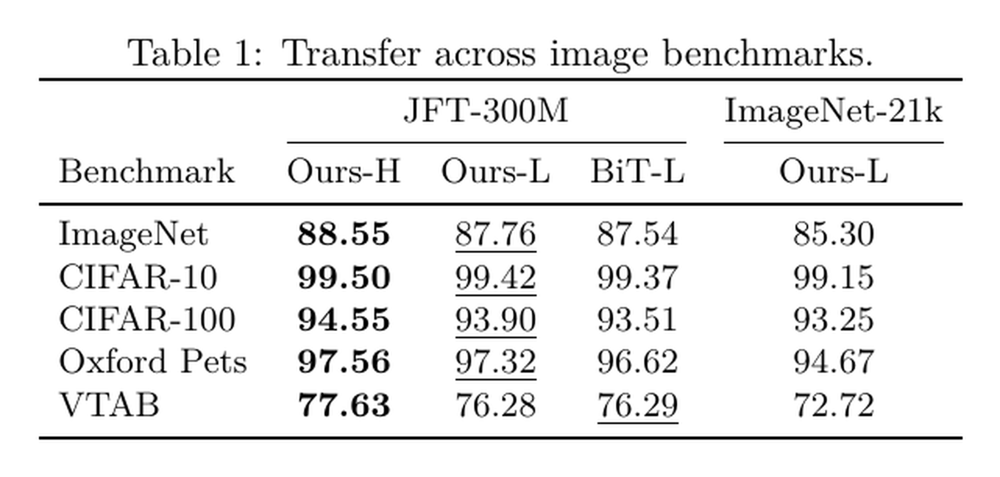
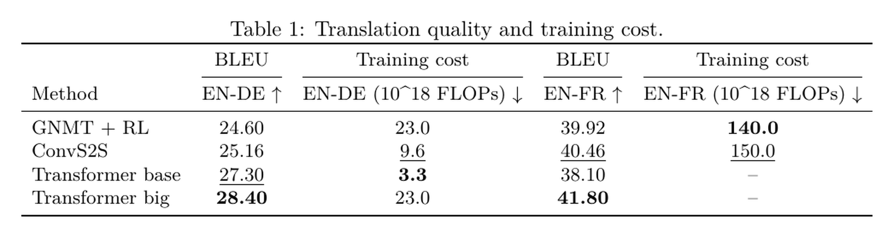
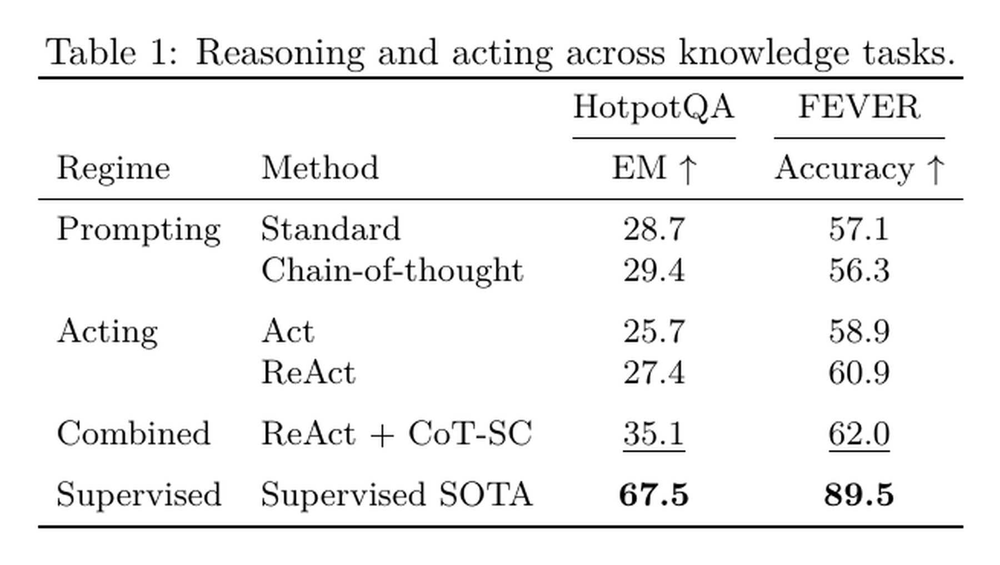
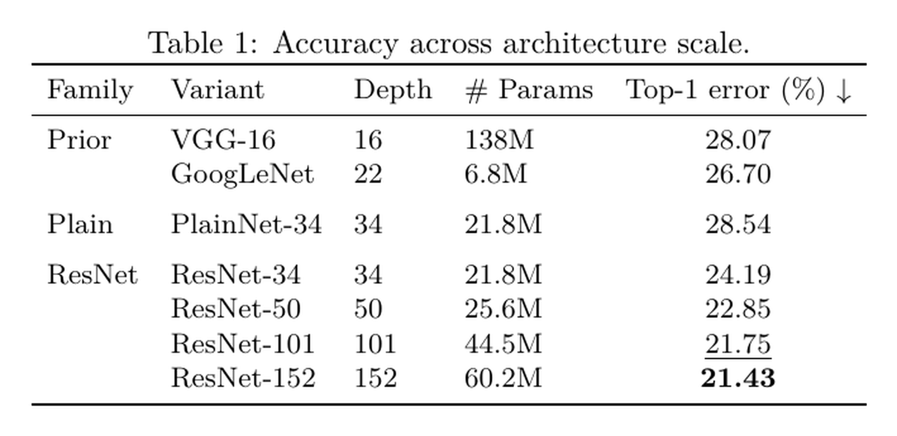

# Paper2Table — Experiment Files to Caption + Table

[](https://github.com/goya4140/PaperTable/actions/workflows/tests.yml)

Paper2Table 的产品边界只有一句话：

```text
输入：CSV / TSV / JSON / JSONL 实验结果文件
输出：caption + table
```

这个仓库首先是一个 Codex Skill，其次才是 CLI。Skill 理解实验文件中的科学比较关系并选择合适布局；确定性流水线负责聚合、排名、渲染和校验。**方法名称逐字取自输入文件，系统不会自行总结、润色或命名。**

`caption.txt` 与 `table.tex`（以及便于查看的 `table.html`）是用户产物；manifest、标准化数据和 preview 只是内部验证材料。

Caption 默认只有一句简洁的表格主题说明。指标计算、比较对象、实验设置和限制条件留给论文正文；表格底部不渲染任何说明文字。

通栏分类行只用于至少包含两个方法的真实类别。单个方法不会再单独占用一行作为分类标题，而是直接显示为数据行。

## 真实生成效果

下列图片由仓库内的 gallery 数据通过完整流水线生成，再从 `preview.pdf` 渲染得到，不是手工画表。数据均为版式测试用的示例值。

### 可选的家族组带：限定排名范围 + 焦点行



这张表显式区分 proprietary、general generation、unified multimodal 和 agentic systems；只在 non-proprietary systems 中计算 best/second-best，但仍保留 proprietary 结果作为参考。

### 数字语法：mean ± SD + 主值旁的辅助增量



主值、重复实验波动和相对指定 baseline 的绝对增量同时保留；辅助增量使用独立次级槽位，不移动各行主值的对齐轴，也不参与 best/second-best 排名。

### 模型 / 方法 / 可训练参数分层



### 数据集作为行，系统作为列



### 质量与训练成本并列表达



### 不同推理范式的紧凑比较



将 prompting、acting、combined 与 supervised reference 用留白分段；只有当制度边界必须贯穿数值列时，才把它升级为横线。

### 同一家族的模型规模与深度变体



模型家族、具体变体、深度与参数量分别占列。family 边界可以根据阅读需要采用无分隔、留白、横线或组带，而不是固定画线。

## 为什么不只有一个“万能表”

我们检查了 [BERT](https://aclanthology.org/N19-1423/)、[LoRA](https://openreview.net/forum?id=nZeVKeeFYf9)、[Vision Transformer](https://openreview.net/forum?id=YicbFdNTTy)、[Transformer](https://papers.neurips.cc/paper_files/paper/2017/hash/3f5ee243547dee91fbd053c1c4a845aa-Abstract.html)、[FlashAttention](https://papers.neurips.cc/paper_files/paper/2022/hash/67d57c32e20fd0a7a302cb81d36e40d5-Abstract-Conference.html)、[ResNet](https://openaccess.thecvf.com/content_cvpr_2016/html/He_Deep_Residual_Learning_CVPR_2016_paper.html)、[MAE](https://openaccess.thecvf.com/content/CVPR2022/html/He_Masked_Autoencoders_Are_Scalable_Vision_Learners_CVPR_2022_paper.html)、[ReAct](https://openreview.net/forum?id=WE_vluYUL-X)、[BLIP-2](https://proceedings.mlr.press/v202/li23q.html)、[LLaVA](https://papers.neurips.cc/paper_files/paper/2023/hash/6dcf277ea32ce3288914faf369fe6de0-Abstract-Conference.html)、[ConvNeXt](https://openaccess.thecvf.com/content/CVPR2022/html/Liu_A_ConvNet_for_the_2020s_CVPR_2022_paper.html)、[BirDRec](https://papers.neurips.cc/paper_files/paper/2023/file/08309150af77fc7c79ade0bf8bb6a562-Abstract-Conference.html) 和 [MGM](https://proceedings.mlr.press/v162/bao22c.html) 等论文的实验表。跨论文稳定出现的不是一套装饰风格，而是一个语义骨架：

```text
[system identity / protocol / budget] | [measured evidence] | [optional cost or aggregate]
```

因此 Paper2Table 会先对完整输入规划 `comparison contract → rows → groups → columns → values → emphasis → caption`，再选择或调整模板。`Model`、`Method`、`Pre-train Data`、`Budget`、`Protocol` 等身份字段与指标彻底分开；横线、留白、组带和高亮只是可选语义通道，不是模板必须项。分组带只在至少两个方法家族各含两条结果时出现，避免由孤立分类行破坏视觉层级。完整规则见 [design grammar](references/design-grammar.md)，论文观察和设计映射见 [pattern catalog](references/pattern-catalog.md)。

## 七类可复用起点

| Template | 适用的科学比较 | 关键表达 |
|---|---|---|
| `benchmark-wide` | 多任务、多指标 | 方法为行，dataset × metric 多级表头 |
| `family-banded-benchmark` | 稠密 leaderboard 且至少两个家族各含两种方法 | 并列通栏组带、排名范围、焦点行和缺失值 |
| `hierarchical-method-budget` | PEFT / 微调方法 | model、method、trainable params 分列 |
| `transposed-benchmark` | 数据集多、焦点系统少 | dataset 为行，system 为列，可按预训练数据分组 |
| `quality-efficiency` | 质量—成本权衡 | quality、time/FLOPs、speedup 独立呈现 |
| `scaled-variants` | 模型规模 / 深度消融 | family、variant、depth、params 分列 |
| `compact-regime-comparison` | 少量任务与多种方法机制 | prompting / acting / combined / oracle 分块 |

选择规则见 [template selection](references/template-selection.md)。模板只是可覆盖的 JSON 起点；也可以不用模板，直接由输入几何生成平面表。

## 作为 Skill 使用

把仓库放入 Codex skills 目录：

```bash
git clone https://github.com/goya4140/PaperTable.git \
  ~/.codex/skills/paper2table
```

然后在 Codex 中直接说：

```text
$paper2table 读取 results.csv，保留文件中的方法名称，为我生成 caption 和 LaTeX table。
```

Skill 会先识别比较维度和科学口径，再选择模板。具体行为和不可越过的数据约束定义在 [SKILL.md](SKILL.md)。

## CLI 快速开始

Python 3.10+，运行时无第三方 Python 依赖。

```bash
python scripts/generate_main_table.py list-templates

python scripts/generate_main_table.py generate \
  examples/gallery/family_banded.csv \
  --template family-banded-benchmark \
  --config examples/gallery/family_banded.json \
  --out output/main-table
```

也可以安装 CLI：

```bash
python -m pip install -e .
paper2table generate results.csv --template benchmark-wide --config table.json --out output/main-table
```

`--template` 可以是内置 template ID，也可以是自定义 JSON 路径。配置会深度覆盖模板；输入契约见 [input contract](references/input-contract.md)，布局字段见 [template schema](references/template-schema.md)。

## 产物与保证

```text
experiment files → verified internal pipeline → caption.txt + table.tex/table.html
```

- `caption.txt` 与 `table.tex` / `table.html` 是最终交付。
- `observations.json` 保留标准化后的每个观测和来源。
- `aggregates.json` 保留 mean、sample SD、`n`、run IDs 和身份维度。
- `table-spec.json` 是与 LaTeX / HTML 解耦的语义中间层。
- `manifest.json` 列出警告、被省略列和校验结果；只有 `verification.valid = true` 才是有效生成。
- `manifest.json.method_identity` 记录每个展示名称来自哪个输入字段和文件，策略固定为 `verbatim_from_input`。
- 缺失值始终渲染为 `--` 并排除在排名之外；系统不会伪造误差、显著性或未报告实验。
- proprietary / oracle / incompatible protocol 可以保留在表中作为参考，同时通过 `comparison` 显式排除在 best/second-best 计算之外。
- `auxiliary.delta` 始终保留主结果，并强制 baseline 唯一匹配；不会把提升百分比当成主测量值。

本地有 TeX 时，可编译 `preview.tex`：

```bash
cd output/main-table
latexmk -xelatex preview.tex
```

将 `table.tex` 嵌入论文时需要 `booktabs`；使用宽表、组带或行高亮时还需要 `graphicx` 和 `\usepackage[table]{xcolor}`。

## 测试

```bash
python -m pip install -e '.[dev]'
pytest
```
