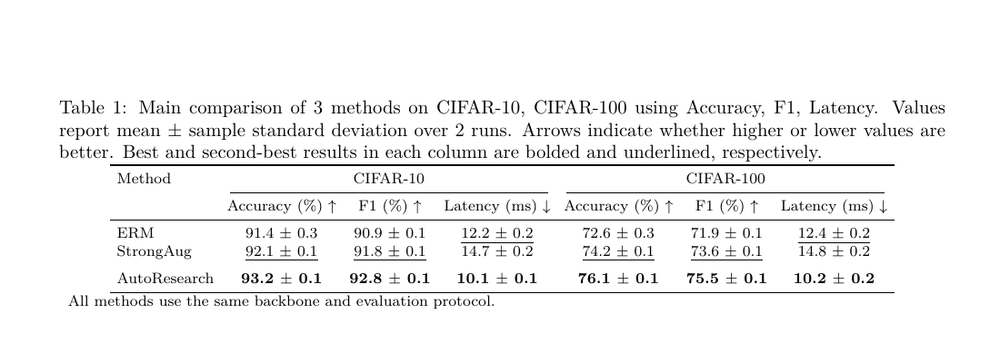

# PaperTable（精简版）

[](https://github.com/goya4140/PaperTable/actions/workflows/tests.yml)

把各种实验结果稳定地变成**主实验表格 + 对应 caption**。核心原则只有三个：

1. 先把 CSV / TSV / JSON / JSONL 统一成 observation；
2. 聚合与表格设计分离，并保留每个数字的来源；
3. LaTeX、HTML 和 caption 从同一个 table spec 生成。

## 生成效果

下面的预览由仓库内的 [`examples/main_results.csv`](examples/main_results.csv) 和
[`examples/main_table.json`](examples/main_table.json) 通过真实流水线生成，而非手工绘制。



> **自动生成的 caption：** Main comparison of 3 methods on CIFAR-10, CIFAR-100 using Accuracy, F1, Latency. Values report mean ± sample standard deviation over 2 runs. Arrows indicate whether higher or lower values are better. Best and second-best results in each column are bolded and underlined, respectively.

当前回归测试覆盖宽表、嵌套 JSON、method/dataset/metric 筛选、主表列预算、宽表 score 指标和重复 run 拒绝。GitHub Actions 会在每次 push 和 pull request 时运行完整测试。

本仓库刻意不包含论文写作、图表、benchmark 爬取、VLM 美学评分或自动显著性检验。它只解决一条短而可验证的生产链：

```text
experiment files
      ↓ ingest
canonical observations
      ↓ aggregate
auditable mean / sample SD / n
      ↓ plan
main-table semantic spec
      ↓ render
table.tex + table.html + caption.txt
```

## 30 秒开始

Python 3.10+，运行时没有第三方依赖。

```bash
python -m pip install -e .
papertable generate examples/main_results.csv \
  --config examples/main_table.json \
  --out output/main-table
```

也可以不安装：

```bash
PYTHONPATH=src python -m papertable generate examples/main_results.csv \
  --config examples/main_table.json \
  --out output/main-table
```

产物包括：

| 文件 | 用途 |
|---|---|
| `observations.json` | 所有输入的统一长格式 |
| `aggregates.json` | mean / sample SD / n / run IDs / sources |
| `table-spec.json` | 与渲染器解耦的语义表格 |
| `table.tex` | booktabs 风格、可编辑 LaTeX |
| `table.html` | 浏览器预览 |
| `caption.txt` | 与表格内容同步的 caption |
| `preview.tex` | 可直接编译的最小预览文档 |
| `manifest.json` | 数量、警告、遗漏列和产物清单 |

LaTeX 只需要在论文导言区加载：

```latex
\usepackage{booktabs}
```

本地安装 TeX 时可预览：

```bash
cd output/main-table
latexmk -xelatex preview.tex
```

## 支持的输入

### 宽表 CSV / TSV

```csv
group,method,dataset,seed,accuracy,f1,latency_ms
Baselines,ERM,CIFAR-10,1,91.2,90.8,12.4
Baselines,ERM,CIFAR-10,2,91.6,91.0,12.1
Ours,AutoResearch,CIFAR-10,1,93.1,92.7,10.2
```

非身份列中的数值会被当作 metric。存在 `epoch`、`step` 或其他数值元数据时，请在 config 中显式写：

```json
{"input": {"metric_columns": ["accuracy", "f1", "latency_ms"]}}
```

### 长表 CSV / JSON / JSONL

每行使用 `method, dataset, metric, value`；可选 `run/seed/fold, setting, group`。

### 嵌套 JSON

```json
{
  "ERM": {"CIFAR-10": {"accuracy": [91.2, 91.6]}},
  "AutoResearch": {"CIFAR-10": {"accuracy": [93.1, 93.3]}}
}
```

嵌套顺序固定为 `method → dataset → metric → scalar/list-of-runs`。不同输入文件可以在同一次命令中合并。

## 配置的最小语义

```json
{
  "title": "Main results",
  "label": "tab:main",
  "claim": "Our method improves quality while reducing latency.",
  "metrics": {
    "accuracy": {"label": "Accuracy", "direction": "max", "unit": "%", "precision": 1, "priority": 1},
    "latency_ms": {"label": "Latency", "direction": "min", "unit": "ms", "precision": 1, "priority": 2}
  },
  "selection": {
    "methods": ["ERM", "AutoResearch"],
    "datasets": ["CIFAR-10"],
    "metrics": ["accuracy", "latency_ms"],
    "max_columns": 8
  }
}
```

- `direction` 决定箭头和 best/second；建议显式填写。缺失时系统会保守推断并在 manifest 中报警。
- `priority` 只在设置 `max_columns` 时用于主表压缩；所有被省略的列都会进入 manifest，绝不静默丢失。
- 重复实验使用 sample SD；只有一个值时不虚构误差。
- 本版本不自动产生 p-value、置信区间或显著性星号。

## 模板

主实验常见形态已整理在 [模板库](docs/TEMPLATE_GALLERY.md)：多数据集性能、质量—效率、不同规模/设置、鲁棒性，以及单数据集紧凑表。模板只是 config，不锁死代码路径。

架构与扩展边界见 [ARCHITECTURE.md](docs/ARCHITECTURE.md)。

## 测试

```bash
python -m pip install -e '.[dev]'
pytest
```
