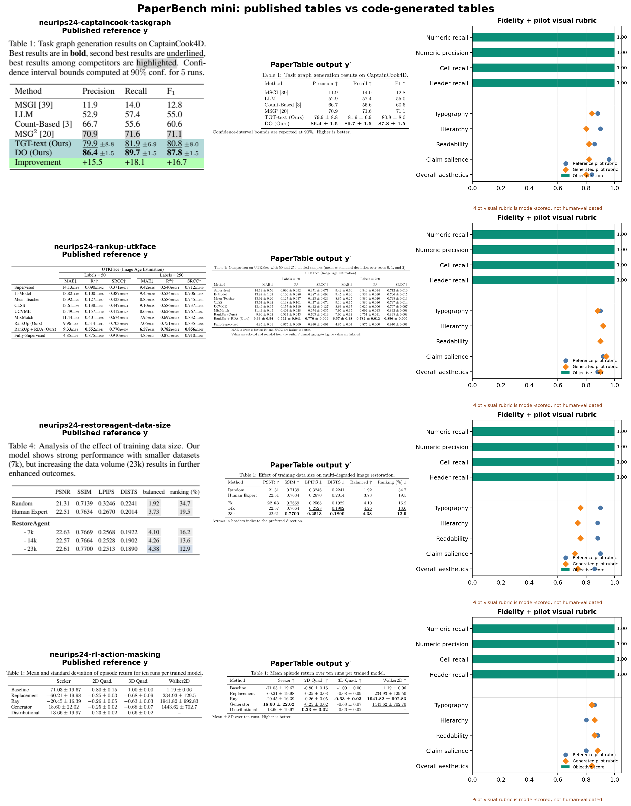

# PaperTable

PaperTable studies code-first generation of publication-quality academic tables. Given experimental data `x`, the Skill implements a generator `f` and produces `y' = f(x)`. PaperBench compares `y'` with the author's published table `y` along two deliberately separate axes:

- **objective fidelity**: were all values, headers, uncertainty fields, and valid comparisons preserved without hallucination?
- **subjective design quality**: is the table readable, well structured, visually polished, and effective at communicating its claim?



## What is included

- A reusable Codex Skill in [`skills/paper-table`](skills/paper-table).
- Deterministic JSON → LaTeX/HTML rendering and numeric verification.
- [`PaperBench`](benchmarks/paperbench): a versioned `(x,y)` dataset schema, real NeurIPS seed cases, evaluation scripts, human-rating protocol, and reference-vs-generated dashboard.
- Candidate discovery manifests: 150 NeurIPS, 25 ICLR, and 25 ICML tables from official 2024 proceedings. Discovery cases are explicitly kept separate from paired benchmark cases.
- External adapters/registry for TableVisBench and TABVERSE rather than silently relicensing their data.
- A [dataset landscape](docs/dataset-landscape.md) covering TableBank, PubTables-1M, SciTSR, TabLeX, SciGen, TABVERSE, TableVisBench, and TASTE.
- A detailed [table-generation dataset and evaluation survey](docs/table-generation-research.md), including task boundaries, metric failure modes, an inquiry benchmark, and implications for the next Skill design.

## Dataset semantics

PaperBench records the strongest available `x`:

| Input tier | Contains | What can be evaluated |
|---|---|---|
| `raw_runs` | per-seed or per-example results | aggregation, uncertainty, selection, and design |
| `canonical_table` | de-styled cells and semantic metadata | content selection, structure, and design |
| `recovered_table` | cells recovered from a paper and manually verified | layout/design only; no claim about experiment aggregation |

The committed mini set contains three `recovered_table` pairs and one `canonical_table` pair from NeurIPS 2024. The canonical RankUp case is built from an author-released aggregate experiment log pinned by commit and hash. It is an executable seed set, not yet a statistically representative leaderboard. Every case contains provenance, an `x.json`, a published `y_reference.png`, and an aesthetic rating record.

## Reproduce the benchmark

```bash
python benchmarks/paperbench/build_seed.py
python benchmarks/paperbench/build_rankup_case.py
python benchmarks/paperbench/evaluate.py
python benchmarks/paperbench/visualize.py
```

Outputs appear in `output/paperbench/`. The current seed run passes the numeric-fidelity gate on all four cases: numeric recall, numeric precision, cell recall, and header recall are all `1.00`, with zero hallucinated numeric tokens.

The dashboard also shows a single model-based pilot visual rubric so the full reporting path is testable. It is labeled as **not human-validated**. Publication-quality aesthetic results require at least three order-randomized human ratings per pair following [`protocol.md`](benchmarks/paperbench/protocol.md).

## Generate one table

```bash
python skills/paper-table/scripts/analyze_data.py examples/main-results.csv --json
python skills/paper-table/scripts/render_table.py examples/main-results.json --out-dir output/example
python skills/paper-table/scripts/verify_table.py examples/main-results.json output/example/table.tex
```

The Skill actively asks for missing repeats, units, metric direction, sample size, comparison design, and intended claim. Simulated variation must be labeled and cannot be used as observed evidence.

## Scale the real-paper set

```bash
python benchmarks/neurips-tables/collect.py --year 2024 --papers 50 --max-tables 200
```

The collector uses official proceedings and stores PDFs/crops in ignored local caches. A discovered table becomes a PaperBench pair only after a structured `x` is linked and verified. Future collection prioritizes NeurIPS, ICLR, and ICML papers with author-released per-seed CSV/JSON artifacts.

Optional external stress test:

```bash
python benchmarks/external/import_tablevisbench.py --limit 20
```

## Evaluation policy

- Numeric fidelity is a hard gate, never hidden inside an aesthetic average.
- Automated contrast/density/aspect measures are called visual proxies, not aesthetics.
- Human comparisons randomize left/right order and report agreement and position bias.
- Train/reference/test splits are paper-level to prevent same-paper style leakage.
- `y` and its LaTeX source remain hidden until `y'` is frozen.

## License

Code is MIT. Source papers and external datasets retain their original terms. Each benchmark case records provenance and redistribution status; this repository does not relicense source publications.
